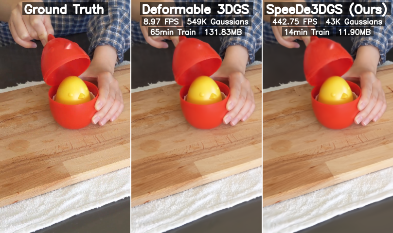

# Speedy Deformable 3D Gaussian Splatting: Fast Rendering and Compression of Dynamic Scenes

## [Project page](https://speede3dgs.github.io/) | Paper (Coming Soon)

[Allen Tu*](https://tuallen.github.io/), [Haiyang Ying*](https://oceanying.github.io), [Alex Hanson](https://www.cs.umd.edu/~hanson/), [Yonghan Lee](https://sites.google.com/view/yonghan-lee/home), [Tom Goldstein](https://www.cs.umd.edu/~tomg/), [Matthias Zwicker](https://www.cs.umd.edu/~zwicker/)

*\* indicates equal contribution*




This repository contains the official implementation associated with the paper "Speedy Deformable 3D Gaussian Splatting: Fast Rendering and Compression of Dynamic Scenes". It is built on top of the [Deformable 3D Gaussians](https://github.com/ingra14m/Deformable-3D-Gaussians) codebase, and the pruning strategy is based on [Speedy-Splat](https://github.com/j-alex-hanson/speedy-splat). If you make use of this code in your research, please consider citing these works in addition to ours.

## Dataset

In our paper, we use:

- Synthetic dataset from D-NeRF.
- Real-world dataset from NeRF-DS and HyperNeRF.

We organize the datasets as follows:

```shell
├── data
│   | D-NeRF 
│     ├── hook
│     ├── standup 
│     ├── ...
│   | NeRF-DS
│     ├── as
│     ├── basin
│     ├── ...
│   | HyperNeRF
│     ├── interp
│     ├── misc
│     ├── vrig
```

## Environment

```shell
git clone https://github.com/tuallen/speede3dgs.git --recursive
cd speede3dgs

conda create -n speede3dgs python=3.7
conda activate speede3dgs

# install pytorch
pip install torch==1.13.1+cu116 torchvision==0.14.1+cu116 --extra-index-url https://download.pytorch.org/whl/cu116

# install dependencies
pip install -r requirements.txt
```

## Train

**D-NeRF:**

```shell
python train.py \ 
    -s path/to/your/dataset/scene \ 
    -m output/exp-name \ 
    --eval \ 
    --is_blender \ 
    --iterations 30000 \ 
    --test_iterations 40000 \ 
    --save_iterations 30000 \ 
    --gflow_flag 
```

**NeRF-DS/HyperNeRF:**

```shell
python train.py \ 
    -s path/to/your/dataset/scene \ 
    -m output/exp-name \ 
    --eval \ 
    --iterations 30000 \ 
    --test_iterations 40000 \ 
    --save_iterations 30000 \ 
    --use_apt_noise \ 
    --gflow_flag 
```


### Render & Evaluation

```shell
python render.py -m output/exp-name --mode render --gflow_flag
python metrics.py -m output/exp-name
```

We provide several modes for rendering:

- `render`: render all the test images
- `time`: time interpolation tasks for D-NeRF dataset
- `all`: time and view synthesis tasks for D-NeRF dataset
- `view`: view synthesis tasks for D-NeRF dataset
- `original`: time and view synthesis tasks for real-world dataset

# BibTex

```
@Article{TuYing2025speede3dgs,
    title={Speedy Deformable 3D Gaussian Splatting: Fast Rendering and Compression of Dynamic Scenes},
    author={Tu, Allen and Ying, Haiyang and Hanson, Alex and Lee, Yonghan and Goldstein, Tom and Zwicker, Matthias},
    journal={arXiv},
    year={2025}
}
```

# Funding and Acknowledgements

This research is based upon work supported by the Office of the Director of National Intelligence (ODNI), Intelligence Advanced Research Projects Activity (IARPA), via IARPA R&D Contract No. 140D0423C0076. The views and conclusions contained herein are those of the authors and should not be interpreted as necessarily representing the official policies or endorsements, either expressed or implied, of the ODNI, IARPA, or the U.S. Government. The U.S. Government is authorized to reproduce and distribute reprints for Governmental purposes notwithstanding any copyright annotation thereon. Commercial support was provided by Capital One Bank, the Amazon Research Award program, and Open Philanthropy. Further support was provided by the National Science Foundation (IIS-2212182), and by the NSF TRAILS Institute (2229885).
